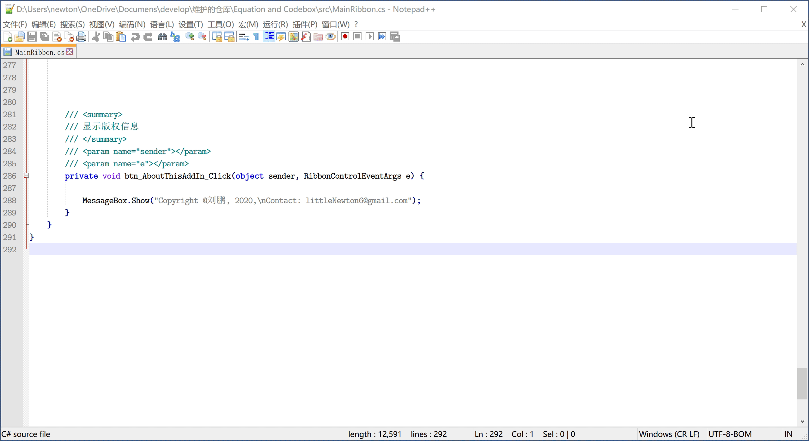

# 关于本插件

GitHub 链接：https://github.com/LittleNewton/Equation_and_Codebox

这是一个 Word VSTO 插件，用来进行以下操作：

- 插入带编号的公式
- 插入代码表格

需要有以下支持：

- 安装 LM Mono 10 字体
- 安装 Latin Modern Math 字体
- 安装 Notepad++ 32bit 编辑器
- Office 2013 及之后的更新的版本

希望对大家有所帮助。

## 1. 编译方法

本插件基于 Visual Studio 2019 开发，打开 `src/Equation and Code.sln` 即可利用 VS2019 对本项目进行更改。

使用 VSTO Word 开发 SDK，需要用 Visual Studio Installer 获取相应 SDK。

## 2. 使用方法

详细使用方法，请参考哔哩哔哩的[视频](https://www.bilibili.com/video/BV1f5411p7pN/)。

上述视频可能不是有关本插件的最新教程，但是可以帮助新手快速上手。

### 2.1 插入公式

在节标题的后面插入【域代码】，是公式编号的**必要条件**。

### 2.2 插入代码

插入代码，需要首先将要插入的代码的【纯文本】复制到剪贴板。

> 最后必须有个**空行**。

#### 2.2.1 插入普通代码 (行号的步长为 1)

#### 2.2.2 自主设置行号的步长

当每行代码不超过 96 个半角字符时，可以自主设置行号步长。如下图所示。

## 3. 开源许可

本软件遵循 MIT 开源许可。
